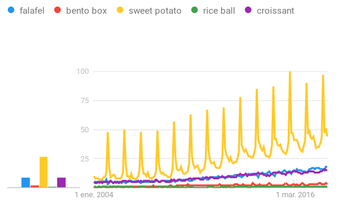

Proposal to Add Emoji Symbol for **Falafel** to Unicode 
====================================================================

-   **Author:** Ben Klemens

-   **Mail:** ben@klemens.org

-   **Submitted:** xxx

Abstract
------------

This proposal requests the addition of a **Falafel** emoji to a future version of the
Unicode Standard.  The emoji food set is lacking in Middle Eastern and North African
foods, and in unambiguously vegetarian, kosher, or halal foods outside of fruits and
vegetables. A falafel emoji fills these gaps.

Introduction
------------

Falafel is a ball of fried chickpeas or fava beans, and is popular in the Middle East
and North Africa, and increasingly throughout the world.  One of its key advantages is
that it accommodates a range of food preferences: given reasonable care in preparation,
it is vegan and vegetarian, halal, and kosher (for the remainder of this proposal, "VHK")

The food category in the emoji set includes a wide range of fruits and vegetables, but
very little else that is VHK. For example, cheeses may not be VHK due to rennet, and the
Japanese origins of emoji have led to a wide range of shellfish-based foods. The current emoji set
has good representation of foods from the American and East Asian regions, but
very little from the Middle East and North Africa.

Expected Usage
------------

### Frequency

Google's heavily English-language database indicates that the usage of "falafel" is roughly as popular as "croissant", and noticeably more popular than some of the Japanese foods represented in the emoji set (see figure). 
The figure includes "sweet potato", which is more popular in Google's database, but clearly seasonal, while Falafel shows consistent usage.

### Multiple uses

### Image distinctiveness
The ideal falafel is briefly fried so that the exterior is brown, but the interior remains green. The brown-to-green pattern is distinctive and easily recognized even at small resolutions.

### Completeness
Middle Eastern food has almost no representation in emoji. Distinctive foods commonly found in the melting pot of Middle Eastern cuisine such as shakshuka or baklava are missing.
Döner Kebab has an emoji, though the proposal (UTC document L2/15-084) makes no reference to the Middle East and instead bills it as "Germany's most favorite fast food snack."
Falafel would be the first VHK Middle Eastern food represented in emoji.

Selection Factors for Exclusion
------------

### Overly specific

Falafel has the level of specificity of many other emoji, such as the croissant.

### Open ended

Falafel recipes are largely uniform, so there is no need for additional emoji for different falafel subtypes.

### Already Representable

Closely comparable emoji are not reasonable substitutes for falafel. As above, a key feature of falafel is that it is unambiguously VHK.

Döner Kebab is wrapped in a manner that bears a visual similarity to some forms of falafel, but is an entirely distinct food.

Falafel is often served in the form of a stuffed pita, but the stuffed flatbread
emoji is designed to be ambiguous about its contents---and even whether the flatbread is a
pita at all, or a frybread or focaccia. "Emoji Additions Tranche 6: More
Popular Requests and Gap Filling" (UTC document L2/15­195R2) does propose "falafel" as an alias,
but the proposal describes "ingredients, such as meat, vegetables, and condiments",
and the proposed character in that document shows brown strips that can not be falafel.

### Transient

The plot above from Google's database shows consistent usage of "falafel" since 2004. Before
that date, falafel has been consumed in the Middle East and nearby areas for a millennium
or more.

Location on the emoji keyboard
------------

Falafel is often served as a wrap or in a flatbread, so sequencing it before Döner Kebab
facilitates the *falafel + kebab wrap* and the *falafel + flatbread* pairs, which could
transform the wrap and flatbreat emoji into unambiguous representations of a falafel wrap
or pita.
