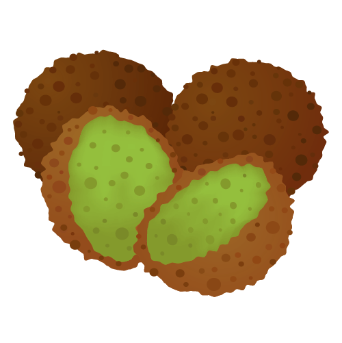
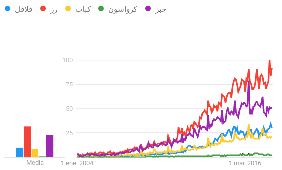

Proposal to Add Emoji Symbol for **Falafel** to Unicode 
====================================================================

This document is now a PDF generated vi LaTeX. 

.

-   **Author:** Ben Klemens

-   **Mail:** ben@klemens.org

-   **Submitted:** xxx

Abstract
------------

This proposal requests the addition of a FALAFEL emoji to a future version of the
Unicode Standard.  The emoji food set is lacking in Middle Eastern and North African
foods, and in unambiguously vegetarian, kosher, or halal foods outside of fruits and
vegetables. A falafel emoji addresses these gaps.

Introduction
------------

FALAFEL is a ball of fried chickpeas or fava beans, and is popular in the Middle East
and North Africa, and increasingly throughout the world.  One of its key advantages is
that it accommodates a range of food preferences: given reasonable care in preparation,
it is vegan and vegetarian, halal, and kosher (for the remainder of this proposal, "VHK")

The proposed emoji would picture three falafel balls, with one in the center split open to
reveal the green interior of the ball. Below is a sample rendering by Aphee Messer.

The food category in the emoji set includes a wide range of fruits and vegetables, but
very little else that is VHK. For example, cheeses may not be VHK due to rennet, and the
Japanese origins of emoji have led to a wide range of explicitly or likely
shellfish-based food emoji. The current emoji set has good representation of foods
from the American and East Asian regions, but very little from the Middle East and
North Africa.

Expected Usage
------------

### Frequency

Google's English-language database indicates that the usage of "falafel" is roughly as popular as "croissant", and noticeably more popular than some of the Japanese food emoji (see figure). 
The figure includes "sweet potato", which is more popular in Google's database but clearly seasonal, while Falafel shows consistent usage.

To preserve the scale, "rice" was omitted from the plot of English search terms:
being a basic staple, it was searched on Google 17 times more often than "falafel".

But among Arabic search terms, falafel is in the same range as basic staples.  "Rice"
(رز, in red) appears in Google's database of searches only three times as often as
falafel (فلافل, in blue).  Even "bread" (خبز, in purple) is only 70% more
popular than falafel at the end of this period. Falafel seems slightly more popular than "kebab" (كباب,
in yellow), while "croissant" (كرواسون, in green) is largely unknown.

### Multiple uses

### Image distinctiveness
The ideal falafel is briefly fried so that the exterior is brown, but the interior remains green. We believe, from
our conversations, that we should show three falafel balls, and one of the of the balls should be cut open to show
the distinctive green color. The brown-to-green pattern is distinctive and easily recognized even in small fonts.
However, we leave it to the vendors to choose the most effective designs.

### Completeness
Middle Eastern food has almost no representation in emoji. Distinctive foods
commonly found in the melting pot of Middle Eastern cuisine such as kebabs, hummus, shakshuka or
baklava are missing.  Döner kebab has an emoji in the form of STUFFED FLATBREAD, though the proposal ([UTC document
L2/15-084](http://www.unicode.org/L2/L2015/15084-kebab.pdf)) makes only brief reference
to its Turkish origins and instead bills it as "Germany's most favorite fast food snack."
FALAFEL would be the first VHK Middle Eastern food represented in emoji.

Selection Factors for Exclusion
------------

### Overly specific

FALAFEL has a level of specificity comparable to many other emoji, such as those for the croissant, bento box, or döner kebab. And it is as prominent for a particular region of the world which is currently underrepresented.

### Open ended

FALAFEL recipes are largely uniform, so there is no need for additional emoji for different falafel subtypes. In addition, in our quick unscientific poll of Middle Easterners, FALAFEL ranks among the highest for both being culturally relevant, and visually distinctive. In contrast, HUMMUS has been previously proposed and rejected by the Unicode Technical Committee. The universe of iconic and visually distinctive foods in the Middle East is fairly scoped.

### Already Representable

Closely comparable emoji are not reasonable substitutes for falafel.

The KEBAB emoji depicts döner kebab wrapped in Lafah, a thin wrap sometimes used to serve
falafel, but despite the similarity in wrapping method, a kebab is an entirely distinct food from falafel.
As above, a key feature of falafel is that it is unambiguously VHK.

Falafel is often served in the form of a stuffed pita, but the STUFFED FLATBREAD
emoji is designed to be ambiguous about its contents---and even whether the flatbread is a
pita at all, or a frybread or focaccia. "Emoji Additions Tranche 6: More
Popular Requests and Gap Filling" ([UTC document L2/15 195R2](https://www.unicode.org/L2/L2015/15195r2-emoji-add-tranche6.pdf)) does propose "falafel" as an alias,
but the proposal describes "ingredients, such as meat, vegetables, and condiments",
and the proposed character in that document shows brown strips that can not be FALAFEL.

Beyond Lafah and pita, one may also find falafel on a mezze plate along with other small
dishes. Expressing the latter use with existing emoji, for example via
STUFFED FLATBREAD + FORK AND KNIFE WITH PLATE, may leave significant ambiguity that
the author is writing about flatbread containing primarily falafel, minus the flatbread.

### Transient

The plot above from Google's database shows consistent usage of "falafel" in the
English-speaking world since 2004. Pre-Internet, falafel has been consumed in the
Middle East and nearby areas for a millennium or more.

Location on the emoji keyboard
------------

FALAFEL as street food is served as a wrap or in a flatbread, so sequencing it before KEBAB
(picured in a wrap) facilitates the FALAFEL + KEBAB and the FALAFEL + STUFFED FLATBREAD pairs, which could
transform the wrap and flatbreat emoji into unambiguous representations of a falafel wrap
or pita.
